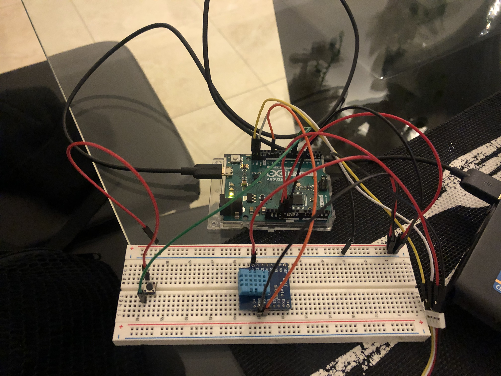

# DHT11_Arduino_Test
# Leo VIDAL / Moussa OUDJAMA
# 4 MOC

# VUE D'ENSEMBLE : 
Exercice effectuer dans le cadre de la compréhension et de la réalisation d'un environnement sous arduino.
L'objectif était d'afficher le niveau de la température et  del'humidité à l'aide d'un capteur et d'un ecran LCD. Pour aller plus loin il était possible de mettre en place une alarme avec une LED.

# ECRAN LCD EXEMPLE : 

# CAPTEUR DHT11 EXEMPLE : 

Pour l'utilisation et la compréhension du capteur DHT11 nous avons du nous reposer sur cette documentation : https://components101.com/sites/default/files/component_datasheet/DHT11-Temperature-Sensor.pdf

# LED EXEMPLE : 

